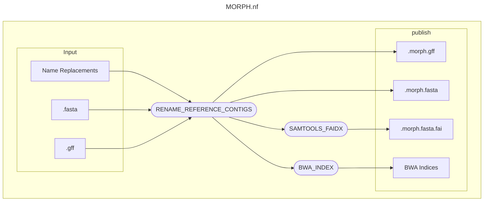

# MORPH: Modification of Reference Files

## What is MORPH?
MORPH is a Nextflow pipeline built to prepare reference genome sequences and annotations for use with [XENO](https://github.com/EcoEvoGenomics/XENO) and [RIPLEY](https://github.com/EcoEvoGenomics/RIPLEY). Because XENO and RIPLEY enforce strictly alphanumerical contig names, MORPH exists to easily rename contigs in `.fasta` and `.gff` files. After renaming the contigs, MORPH also (re)builds the fasta index and the bwa index required to run XENO. The original `.fasta`, `.gff` and index files are *not* modified in place.



Unlike XENO and RIPLEY, MORPH enforces no contig naming scheme of its own. So if you wish, you are very welcome to use MORPH separately from XENO and RIPLEY. For [our](https://github.com/EcoEvoGenomics) part, acknowledgement or citation for your use of MORPH is unnecessary. However, citations for the relevant third-party software are listed [here](#third-party-software).

## Quickstart
### Installation
Please refer to the [XENO documentation](https://github.com/EcoEvoGenomics/XENO#installation) for applicable instructions.

### Input
The reference genome sequence must be in uncompressed `.fasta` format and the annotation file in uncompressed `.gff` format. The only separate input is a tab-delimited file with contig name replacements. Original contig names should appear in the first column, and new contig names in the second. For instance, for the [*Passer domesticus* reference genome assembly](https://www.ncbi.nlm.nih.gov/datasets/genome/GCF_036417665.1/):
```
NC_087474.1	chr1
NC_087475.1	chr2
NC_087476.1	chr3
NC_087477.1	chr4
NC_087478.1	chr5
NC_087479.1	chr6
NC_087480.1	chr7
NC_087481.1	chr8
NC_087482.1	chr9
NC_087483.1	chr10
NC_087484.1	chr11
NC_087485.1	chr12
NC_087486.1	chr13
NC_087487.1	chr14
NC_087488.1	chr15
NC_087489.1	chr16
NC_087490.1	chr17
NC_087491.1	chr18
NC_087492.1	chr19
NC_087493.1	chr20
NC_087494.1	chr21
NC_087495.1	chr22
NC_087496.1	chr23
NC_087497.1	chr24
NC_087498.1	chr25
NC_087499.1	chr26
NC_087500.1	chr27
NC_087501.1	chr28
NC_087502.1	chr29
NC_087503.1	chr30
NC_087504.1	chr31
NC_087505.1	chr32
NC_087506.1	chr33
NC_087507.1	chr34
NC_087508.1	chr35
NC_087509.1	chr36
NC_087510.1	chr37
NC_087511.1	chrW
NC_087512.1	chrZ
NC_025611.1	mtDNA
```
Original contig names which do not appear in the first column of the conversion file will be left in place.

### Launching MORPH
With Nextflow accessible in your terminal environment, navigate to the `MORPH` repository. Configure `nextflow.config` as appropriate to your terminal environment. Execute the following command (the `-profile` flag is optional and depends on your configuration):
```sh
nextflow run MORPH.nf -profile config_profile --fasta ref.fasta --gff ref.gff --morphs replacement_names.tsv
```
Outputs are published to `MORPH/output`. Remember that it is best to use a job scheduler or screen terminal to allow time for building the sequence index and bwa index. Please refer again to the [XENO documentation](https://github.com/EcoEvoGenomics/XENO#launching-xeno-on-a-screen-terminal) for additional applicable instructions.

## Third-party software
Thank you for using MORPH. We kindly encourage you to cite the following resources where appropriate:
- [Nextflow v. 25.04.6](https://doi.org/10.1038/nbt.3820)
- [bwa v 0.7.17](https://doi.org/10.48550/arXiv.1303.3997)
- [SAMtools v. 1.17](https://doi.org/10.1093/gigascience/giab008)

The script section in process [`RENAME_REFERENCE_CONTIGS`](MORPH.nf) was developed with assistance of [GLM 5.2](https://gpt.uio.no/en), an open-weight reasoning model hosted on [NTNU](https://www.ntnu.no/) infrastructure.

---
MORPH v. 1.0.0 | 2026 | Erik Sandertun Røed | https://github.com/EcoEvoGenomics/MORPH
